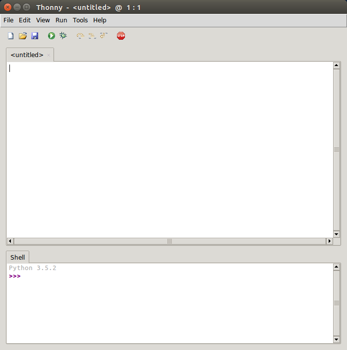

`Thonny` est un environnement de programmation en Python (IDE en anglais pour Integrated Development Environment) conçu pour les débutants. C'est un logiciel **libre** et gratuit que l'on peut installer sur les plateformes usuelles Windows, Mac et Linux. C'est l'outil de programmation **privilégié** que vous utiliserez pour chacun de vos TP de programmation.

# Installation

L'installation est très simple et peut se faire sous Linux, Windows ou Mac. Il est **absolument fondamental** d'installer `Thonny` chez vous !

* Allez sur [https://thonny.org/](https://thonny.org/) pour télécharger thonny

* Une [vidéo en français](https://youtu.be/BGn-VMk7vvc?list=PLxZl6Qtaf2ewu_F15Xp4bH_yy2GVyOgO9) sur l'installation et la présentation de l'environnement de Thonny

**Remarque :** Je vous conseille de choisir "english" lors de l'installation, le français étant pour l'instant en version Beta au moment où j'écris ce texte...

# Lancement de Thonny

Deux façons de lancer Thonny :

* cliquer sur l'icône icône thonny  se trouvant sur la barre de gauche du bureau en salle de TP.   
  (Parfois Thonny ne se lance pas sur Linux/Ubuntu. Dans ce cas, cliquer sur  permettra de le lancer.)

* lancer un terminal de commandes en cliquant sur  puis tapez la commande `thonny &` dans la fenêtre du terminal

# Un petit tour dans Thonny

Quelque soit le moyen utilisé pour lancer l'exécution de `Thonny`, vous devez avoir une fenêtre qui s'ouvre qui ressemble à celle-ci :

Cette fenêtre présente une barre de menus et sous cette barre, par défaut, deux zones pour l'instant blanches :

* l'une nommée (pour l'instant) \<untitled> ;
* l'autre Shell.

La zone \<untitled> est une zone d'édition dans laquelle vous pourrez rédiger votre code, c'est-à-dire votre programme. La zone Shell est celle où vous pouvez exécuter des commandes Python (vous pouvez remarquer la mention de la version de Python utilisée par exemple Python 3.5.2).

Ce sont ces deux zones que vous utiliserez essentiellement lors de tous vos travaux d'informatique par un va et vient entre ces deux zones : la zone d'édition pour rédiger/corriger/améliorer votre code, et le shell pour exécuter une commande Python.

**Remarque :** Il est très important de bien comprendre les spécificités de ces deux zones (la zone d'édition) et le Shell. Ce point sera abordé lors des premiers TP en python.

## La zone Variables

Dans le menu View, Sélectionner *Variables* afin d'obtenir la figure ci-dessous.

Cette zone représente la mémoire de l'ordinateur et notamment les **variables** et leurs **valeurs** connues par votre programme. C'est un outil permettant de mieux comprendre et debugger votre code. Il est donc important de toujours garder un oeil sur cette zone.

**Remarque :** La notion de variable, fondamentale en informatique, sera abordée en tout début d'année

# Utilisation du mode pas à pas

Lorsqu'un programme ne fonctionne pas comme vous le voulez et que vous ne trouvez pas le problème, il faut penser à utiliser le mode à pas  en cliquant sur l'icône représentant un "bug" (autrement dit une [bestiole](https://fr.wikipedia.org/wiki/Bug_(informatique)))

Ce mode permet d'aider le programmeur à trouver l'origine du problème. Pour cela, thonny va exécuter chaque instruction une par une, ce qui permet de voir l'état de l'ordinateur et le déroulement exact du programme. Pour passer à l'instruction suivante, il faut utiliser la touche `F7`.

[Vidéo d'explication sur le mode pas à pas](https://youtu.be/nwIgxrXP-X4) (en anglais)

**Remarque :** L'utilisation de ce mode sera vu en temps utile lors des TP.

# Installation de modules en python

> Remarque : Il se peut que vous ayez déjà python installé sur votre machine. Il faut savoir que Thonny est complètement indépendant de toute autre installation python. Il en va de même pour les modules : Pour utiliser un module dans Thonny, il faut qu'il soit installé dans Thonny même si ce module a déjà été installé sur votre machine

1. Allez dans le menu **Tools** puis cliquer sur **Manage packages**  

2. Dans la partie de gauche apparaît les modules installés dans Thonny, si le module que vous souhaité n'y apparaît pas, il faut l'installer.  
Pour cela, tappez le nom de votre module (par exemple ici "folium", un module permettant de faire de la cartographie), puis cliquez sur **find package fom PyPi**  

3. La fenêtre suivante vous montre le module trouvé par Thonny. Assurez-vous que c'est bien celui que vous voulez installer puis cliquez sur **Install**  

4. Le téléchargement du module se fait depuis le site [https://pypi.org/](https://pypi.org/). A la fin de celui-ci, le module se retrouve dans la partie de gauche.  
Vous pouvez donc l'utiliser dans vos programme (grâce à la directive `import`). Cliquez sur **close**  

