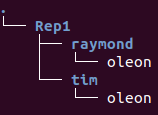

# Mise en route

1. **Ouvrer** un terminal 
2. **Recopier** le prompt et **indiquer** toutes les informations qu'il vous donne :

* nom d'utilisateur :
* machine :
* type d'utilisateur :
* dossier courant  :

# Trouver de l'aide

`man` (manual) est une commande disponible sur les systèmes d'exploitation de type Unix qui permet d'obtenir de la documentation.

* Dans la fenêtre du terminal, **entrer** l'instruction `man ls` pour obtenir le rôle de la commande `ls`.
* **donner** le rôle de la commande `ls`
* Utiliser les flèches ou la barre < ESPACE > pour naviguer dans l'aide
* Utiliser la touche < q > pour quitter l'aide

## Le synopsys du manuel
Le **SYNOPSYS** montre la façon d'utiliser la commande.

Convention de notation du Synopsys :

* les mots **écrits en gras** doivent être écrits tels quels
* les mots soulignés sont obligatoires mais doivent être remplacés par le nom approprié
* ce qui est écrit [entre crochets] est optionnel
* Les points de suspension `...` indique que l'on peut ajouter plusieurs arguments.

Remarque :

* on peut retrouver de l'aide sur une commande particulière en la faisant suivre de l'option `--help`. Essayer : `ls --help`
* Et oui !! Savoir se débrouiller en anglais est indispensable en informatique !!

# Manipuler les fichiers et les répertoires
## Les répertoires

**Tester** les commandes suivantes pour **constater** leur effet :

1. Afficher le répertoire courant en utilisant la commande : `pwd` (print working directory)
2. Afficher le contenu d'un répertoire peut être obtenu au moyen de la commande : `ls` (list directory contents).
3. Créer un nouveau répertoire _"Rep1"_ : `mkdir` (make directory) : `mkdir Rep1`
4. Observer le résultat en affichant le contenu du répertoire
5. Se déplacer dans le dossier _"Rep1"_ : `cd Rep1`. La commande `cd` prend comme **argument un chemin (relatif ou absolu)**
6. Créer un nouveau répertoire _"tim"_
7. Se placer dans ce nouveau répertoire et observer le prompt
8. Afficher le répertoire courant :  `pwd `
9. La commande `cd` (toute bête, sans chemin) permet de revenir dans votre dossier personnel
10. Pas besoin d'être dans le dossier concerné pour en afficher le contenu : tout en étant dans le dossier personnel tester la commande `ls Rep1`

## Les fichiers

1. Placer vous dans le dossier _"tim"_
2. La commande `touch` permet de créer un fichier (fichier vide). Créer un fichier vide _"oleon"_ dans le répertoire _"tim"_ : `touch oleon`
3. Vérifier à l'aide de la commande `ls` que le fichier a bien été créé.
4. Remonter dans l'arborescence : `cd ..`
5. Vérifer que le répertoire courant a bien été modifié : `pwd`
6. Créer un deuxième répertoire : _"raymond"_
7. Copier le fichier _"oleon"_ dans le répertoire "raymond" à l'aide de la commande `cp` (copy) : `cp tim/oleon raymond/`
8. Constater son effet : `ls raymond/`affiche le contenu du répertoire _"raymond"_
9. Placer vous dans votre dossier personnel et tapper `tree`(arbre) afin d'avoir un aperçu de l'arborescence à partir de votre dossier personnel. Cela peut être très utile d'avoir une vue globale sur l'arborescence.
Si vous avez bien fait ce qui est demandé jusqu'ici, vous devez obtenir  

10. On peut supprimer un répertoire avec la commande `rmdir` (remove directory). Se placer dans Rep1 et essayer de supprimer le dossier _"tim"_ : `rmdir tim`
11. Constater que la commande produit une erreur puisque la commande `rmdir` ne fonctionne que sur des répertoires vides (sécurité).
12. Il est possible de supprimer un répertoire non vide, mais pour l'instant effacer le fichier _"oleon"_ qui n'est de toute façon pas d'une grande utilité :  `rm tim/oleon` (remove)
13. Tenter à nouveau la suppression du répertoire _"tim"_ : Constater que la commande ne signale plus d'erreur et que le répertoire a été supprimé.
14. La commande `mv` (move) permet de déplacer des fichiers : `mv raymond/oleon .` Cette commande déplace (move) le fichier _"oleon"_ de _"raymond"_ dans le répertoire courant `.` (ici _"Rep1"_). Remarquer que Ubuntu affiche par défaut les dossiers en bleu et les fichiers en gris blanc.
15. *Etrangement*, la même commande `mv` permet aussi de renommer un fichier. Essayer : `mv oleon arthur`
16. Observer que le répertoire _"raymond"_ ne contient plus rien. Supprimer le répertoire _"raymond"_
17. Tapper : `cp arthur Arthur` puis `ls`. Observer que le répertoire contient maintenant deux fichiers différents dont les noms sont _"arthur"_ et _"Arthur"_ : Le système de fichier est donc **sensible à la casse**.
18. Tapper : `cp arthur .arthur` puis `ls`. Observer que le contenu du répertoire ne semble pas avoir été modifié. Pourtant le fichier ".arthur" a bien été créé : `ls .arthur`. En fait, il s'agit d'un **fichier caché**. La convention adoptée est que tous les fichiers dont le nom commence par un point `.` sont traités comme des fichiers cachés.
19. On peut ajouter une option `-a` à la commande `ls` afin de visualiser tous les fichiers d'un répertoire (y compris les cachés) : `ls -a`. Retrouver toutes les options disponibles d'une commande donnée grâce à la commande `man` : Essayer `man ls`
20. Tester `ls` avec l'option `-l` : `ls -l`. En déduire l'effet de l'option `-l`.
21. Il est possible de cumuler les options. Tester `ls -a -l` et `ls -al`. Observer que le répertoire contient en plus des 3 fichiers :
	* une entrée nommée `.` qui représente le répertoire courant.
	* une entrée nommée `..` qui correspond au répertoire parent.
On retrouve ces deux entrées dans tous les répertoires.
22. Nettoyer maintenant notre répertoire : `rm arthur Arthur .arthur`. La commande `rm` accepte plusieurs arguments. Constater que le répertoire _"Rep1"_ est vide.
23. Consulter l'aide de la commande `rm` et indiquer le rôle des options `-r` et `-d`
24. Avec la commande `touch`, créer 3 fichiers _"fic.txt"_, _"fic1.py"_, _"fic2.py"_
25. Le symbole **joker** `*` permet de remplacer n'importe quelle chaîne de caractères. Executer la commande `rm *.py`. Cette commande permet de supprimer (`rm`) tous les fichiers pourvus que ceux -ci finissent par _".py"_. Constater le résultat avec la commande `ls`.
26. Créer 3 fichiers _"toto"_, _"tata"_ et  _"tonton"_ ainsi qu'un dossier _"sousDossier"_
27. Utiliser le symbole **joker** pour déplacer **uniquement** les fichiers _"toto"_ et _"tonton"_ dans _"sousDossier"_ à l'aide **d'une seule ligne de commande**. Pour cela, remarquer que _"toto"_ et _"tonton"_ commencent par _"to"_ mais pas le fichier _"tata"_. Vérifier avec la commande `ls`
28. Supprimer entièrement tout le contenu du répertoire _"Rep1"_ avant d'entamer la partie suivante.

## Création d'un fichier texte

1. Se placer dans le répertoire _"Rep1"_ et lancer l'éditeur de texte `nano` en tappant `nano monFichier`. Comme le fichier _"monFichier"_ n'existe pas, `nano` va le créer.
2. Tapper *Le shell, ça déchire !!!* et sauvegarder (Touches < CTRL > + < X >)
3. la commande `cat` (concatenate) permet de visualiser le contenu d'un fichier sans avoir besoin de relancer un éditeur de texte. Tapper `cat monFichier`. Remarquer que les extensions sont inutiles mais il est tout à fait possible de les mettre comme sous Windows.

Remarque : En cas de difficulté avec `nano`, il existe de nombreux tutoriels sur internet.

### Créer des fichiers texte, c'est nul !!

Détrompez-vous !!

En fait c'est tout ce dont on a besoin car un programme est un fichier texte !! et si on ne devait garder qu'un seul logiciel sur une machine, ce serait un éditeur de texte (comme `nano`, ou d'autres plus évolués comme `vim` ou `emacs`, ou d'autres...)

### Un programme python...

4. Créer un fichier texte _"monprog.py"_ et y tapper le code python suivant :
```python
touche = input("appuyer sur la touche 'y' pour afficher le message\n")
if touche == 'y':
	print("HELLO WORLD !!!")
else :
	print("J'avais dit la touche 'y' !!!")
```
5. Demander à *Python* d'exécuter le programme monprog.py : `python3 monprog.py`

### Une image...

Portable_pixmap permet de créer des images matricielles monochrome. Un fichier pbm ASCII a pour nombre magique P1

6. Créer un fichier texte _"invader.pbm"_ et y tapper le code suivant (faire un copier-coller):
P1
13 9
0 0 0 0 0 0 0 0 0 0 0 0 0
0 0 0 0 1 0 0 0 1 0 0 0 0
0 0 0 1 1 1 1 1 1 1 0 0 0
0 0 1 1 0 1 1 1 0 1 1 0 0
0 1 1 1 1 1 1 1 1 1 1 1 0
0 1 0 1 1 1 1 1 1 1 0 1 0
0 1 0 1 0 0 0 0 0 1 0 1 0
0 0 0 0 1 0 0 0 1 0 0 0 0
0 0 0 0 0 0 0 0 0 0 0 0 0

7. Ouvrir le ficher _"invader.pbm"_ avec *Gnome Image Viewer* : commande `eog invader.pbm`

# Conclusion

## La commande `file`

Sous Linux, on a vu que "Tout est fichiers". Afin d'obtenir des informations sur un fichier, on peut utilise la commande `file`.
Tester cette commande sur quelques fichiers et répertoires que vous avez créés.

## Un peu de ménage
Tapper `rm -r Rep1` afin de supprimer le doissier Rep1 et tout ce qu'il contient.

## Synthèse

**Recopier** et **compléter** le tableau ci dessous afin de vous **constituer un memento des principales commandes** que vous rencontrez en cours d'année

|nom de la commande|abbréviation de...|rôle de la commande| quelques options et leurs rôles|
|:----:|:----:|:----:|:----:|
|`ls`|list directory contents|affiche le contenu d'un répertoire| -a : tout afficher ; -l : afficher les détails|

## Il y a trop de commandes !!!

Il existe plusieurs milliers de commande, beaucoup d'entre elles prennent plusieurs paramètres et on peut en installer de nouvelles ou d'autres apparaissent à l'installation de nouveau programme.. Bref, il est illusoire de tout connaître sur le shell. Voici une [liste des principales commandes UNIX](https://fr.wikipedia.org/wiki/Commandes_Unix).

* Le [référentiel officiel](https://cache.media.education.gouv.fr/file/SP1-MEN-22-1-2019/26/8/spe633_annexe_1063268.pdf) ne précise pas les commandes à connaître au niveau première NSI...
* Les commandes vues en cours et en TP sont *normalement* suffisantes pour passer l'examen d'autant plus que vous n'aurez pas accès à la documentation `man`
* A vous de les assimiler en **utilisant la console au maximum lorsque vous êtes en classe !**
* **Soyez curieux**, testez, consultez la documentation, essayez !!
* Des solutions existent pour s'entraîner à la maison sur les commandes linux, même en restant sous windows : plus d'information [sur le document de rentrée](../../informations_pratiques/Actualites.md)

## Se faciliter la vie

* L'**autocomplétion** est accessible grâce à la touche < TABULATION >. Elle permet de compléter automatiquement une commande, un chemin etc...
Appuyer 2 fois sur la touche < TABULATION > après avoir tappé au moins une lettre pour obtenir la liste de toutes les commandes commençant par cette lettre
* Il existe des tas de raccourcis clavier qui font gagner du temps... Une liste est disponible [ici](https://openclassrooms.com/fr/courses/43538-reprenez-le-controle-a-laide-de-linux/38076-entrer-une-commande)
