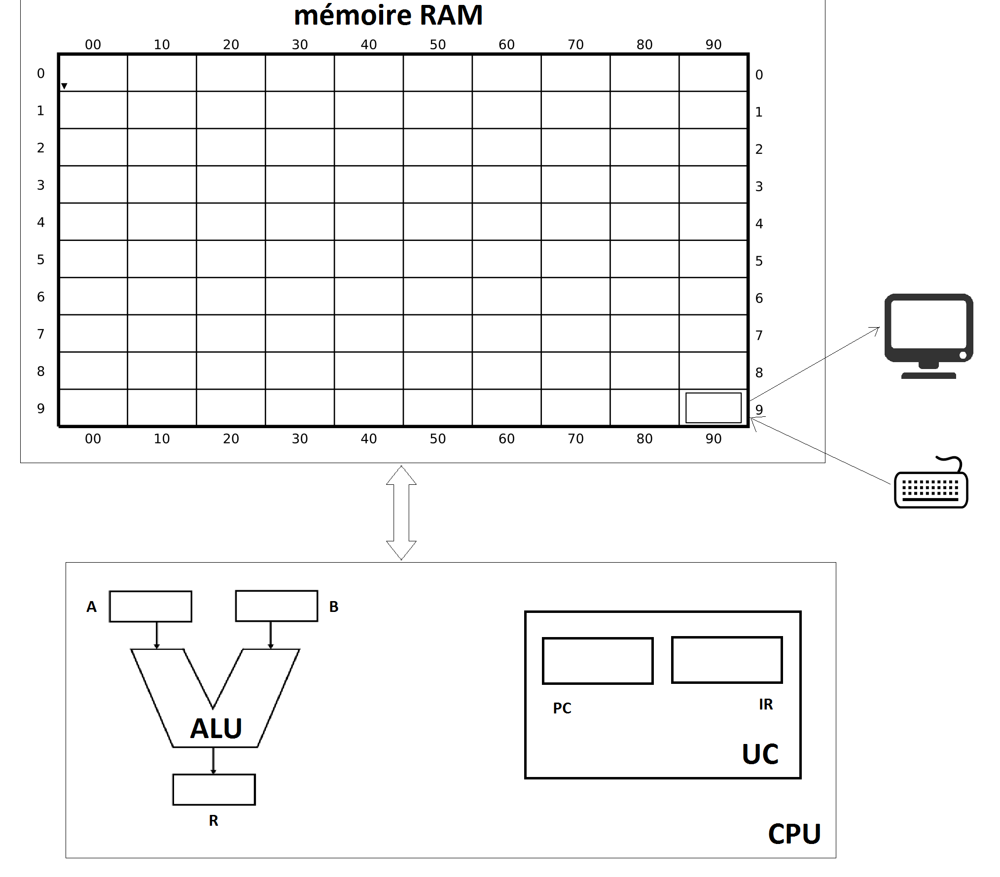

## Mémoire RAM

La mémoire est composée de 100 mots mémoire de 3 chiffres (valeur de 000 à 999). Ces 100 mots mémoire sont adressables par des adresses codées sur 2 chiffres.
Cette mémoire va contenir données et instructions.

## Processeur (CPU)

Comme dans toutes les architectures VON Neumann, le processeur regroupe ALU, Unité de commande et registres.

## Unité arithmétique et logique (ALU)

L'unité arithmétique et logique est en charge d'effectuer les calculs. Les opérandes et résultats sont dans les registres, A et B pour les opérandes, R pour le résultat.

## Unité de commande (UC)

L'UC dispose :
* D'un registre pointeur d'instruction PC contenant l'adresse mémoire de la prochaine instruction à exécuter et d'un registre.
* D'un registre d'instruction IR contenant l'instruction courante à décoder

L'unité de commande pilote l'ordinateur, son cycle de fonctionnement comporte 4 étapes :

1. **charger l'instruction** depuis la mémoire pointée par PC.
2. **décoder l'instruction** : à partir des 3 chiffres codant l'instruction, identifier quelle est l’opération à réaliser, quelles sont les opérandes.
3. organiser l'**exécution de l'instruction**.

## Boot et arrêt

La machine démarre avec la valeur nulle comme pointeur d'instruction. La machine stoppe si le pointeur d'instruction vaut 99.

### Entrées/sorties

Les entrées/sorties sont "mappées" en mémoire :

* **Écrire** sur la case mémoire 99 revient à écrire sur le terminal (affichage à l'écran ).
* **Lire** la case mémoire 99 revient à lire les valeurs saisies sur le terminal (saisie au clavier).

# Jeu d'instruction du processeur M999

Code opération| opérande(s) | mnémonique | instruction réalisée
:---: | :-------: | :----------: | :----------------------:
0 | _addr_ | `LDA`| copie le mot mémoire d’adresse _addr_ dans le registre A
1 | _addr_ | `LDB`| copie le mot mémoire d’adresse _addr_ dans le registre B
2 | _addr_ | `STR`| copie le contenu du registre R dans le mot mémoire d'adresse _addr_
3 | - - | – | **opérations arithmétiques et logiques**
3 | 0 0 | `ADD`| ajoute les valeurs des registres A et B, produit le résultat dans R
3 | 0 1 | `SUB`| soustrait la valeur du registre B à celle du registre A, produit le résultat dans R
3 | . . | etc | …
3 | 9 9 | `NOP` | ne fait rien
4 | _rs_ _rd_ | `MOV` | copie la valeur du registre source _rs_ dans le registre destination _rd_.
5 | _addr_ | `JMP` | branche en _addr_ (PC reçoit la valeur _addr_)
6 | _addr_ | `JPP` | branche en _addr_ si la valeur du registre R est strictement positive

Les registres sont désignés par les valeurs suivantes :

valeur | registre
:------: | :--------:
0 | A
1 | B
2 | R

# Exercice 1

**Recopier** l'état suivant de la mémoire sur une feuille réponse :

```
	 00    01 …
     +-----+----
   0 | 099 |  …
     +-----+----
   1 | 105 |  …
     +-----+----
   2 | 300 |  …
     +-----+----
   3 | 299 |  …
     +-----+----
   4 | 599 | …
     +-----+----
   5 | 001 |  …
     +-----+----
   6 |  ...
   ...
```

Que provoque la mise en route de la machine ?
```
code assembleur :
00:	LDA 99			; saisie clavier dans A
01:	LDB 05			; contenu du contenu de la case mémoire 05 dans le registre B. B contient 01
02 :  ADD			; ajoute A et B. R contient A+1
03 :  STR 99			; copie de R dans la case mémoire 99. On affiche A+1 à l'écran
04:   JMP 99			; PC contient la valeur 99. Arrêt du programme.
```
Ce programme incrémente une valeur saisie au clavier

# Exercice 2

**Recopier** l'état suivant de la mémoire sur une feuille réponse :

```
       00    01    02 …
     +-----+-----+---
   0 | 399 | 599 | 501
     +-----+-----+---
   1 | 011 | 123 | …
     +-----+-----+---
   2 | 112 | 042 | …
     +-----+-----+---
   3 | 301 | 531 | …
     +-----+-----+---
   4 | 608 | 099 | …
     +-----+-----+---
   5 | 402 | 402 | …
     +-----+-----+---
   6 | 299 | 211 | …
     +-----+-----+---
   7 | 599 | 099 | …
     +-----+-----+---
   8 | 412 | 402 | …
     +-----+-----+---
   9 | 299 | 212 | …
     +-----+-----+---
```


1. Que provoque la mise en route de la machine ? Préciser le rôle de ce programme chargé en mémoire ?
```
; code assembleur :

00:	NOP				; on passe
01:	LDA 11			; contenu du contenu de la case mémoire 11 dans le registre A. A contient 123
02:	LDB 12 			; contenu du contenu de la case mémoire 12 dans le registre B. B contient 42
03:	SUB				; R reçoit A-B. R contient 81
04:	JPP 08			; saut en 08 si R>0, c'est-à-dire si A>B. Ici c'est le cas donc le PC contient 08
05:	MOV 02			; contenu de A dans R
06:	STR 99			; contenu de R dans 99, donc on affiche A
07:	JMP 99				; fin d'exécution
08:	MOV 12			; contenu de B dans R
09:	STR 99			; contenu de R dans 99, donc on affiche B
10:	HLT				; fin d'exécution
11:	123				; donnée utilisée dans le programme
12:	42				; donnée utilisée dans le programme

ce programme affiche 123, plus précisément, on affiche le maximum des valeurs des cases 11 et 12
```
2. On reboot la machine en mettant 514 dans la case mémoire 00. Que se passe t'il désormais.
```
; code assembleur :

00:	JMP 14
01: à 12: identique à la question précédente
13: une valeur quelconque
14:	LDA 99			; saisie clavier dans A
15:	MOV A R			; contenu de A dans R
16:	STR 11			; contenu de R, copie de la saisie dans 11
17:	LDA 99			; 2e saisie clavier
18:	MOV A R
19:	STR 12			; copie de la saisie dans 12
20:	JMP 01			; code précédent

ce programme saisit deux valeurs, les écrit dans les mots mémoire 11 et 12, et appelle le code précédent qui va afficher le max des deux valeurs.
```

# Exercice 3

On considère les instructions python ci-dessous
```python
if x > 50: # On considère que la variable x est stockée dans la case mémoire 37
	print(1)
else :
	print(0)
```

1. **Ecrire le code assembleur** correspondant à ces instructions python
```
		00 : LDA 37
		01 : LDB @50		; @50 est la case mémoire où on stocke la valeur 50
		02 : SUB
		03 : JPP vrai
faux : 	04: LDA @0		; @0 est la case mémoire où on stocke la valeur 0
		05 : JMP fin
vrai :	06: LDA @1		; @1 est la case mémoire où on stocke la valeur 1
fin :		07 : MOV 02
		08 : STR 99
		09 : JMP 99
```
2. **Donner** l'état de la mémoire permettant d'exécuter ces instructions (Vous pouvez répondre en complétant une feuille réponse)
```
; On choisit de stocker 50 dans la case mémoire 10, 0 dans la case mémoire 11 et 1 dans la case mémoire 12

00 : 037
01 : 110
02 : 301
03 : 606
04 : 000
05 : 507
06 : 001
07 : 402
08 : 299
09 : 599
10 : 050
11 : 000
12 : 001
```
> On rapelle que la mémoire RAM du M999 permet de stocker uniquement des entiers décimaux de 3 chiffres.
3. Quel est le nombre minimum de bits que doit être capable de stocker une case mémoire.

Il faut au minimum 10 bits car $2^{10} = 1024 \ge 999$
> Ce nombre de bits correpond aux nombres de bits sur lesquels doit être écrite chaque instruction en langage machine.
4. **Ecrire le langage machine** correspondant à ces instructions

0000100101 0001101110 0100101101 1001011110 0000000000 0111111011 0000000001 0110010010 0100101011 1001010111 0000110010 0000000000 0000000001

# Exercice 4

**Objectif**: Écrire un programme M999 de calcul du produit de deux entiers (Attention : on ne dispose pas de l'opération de multiplication dans le jeu d'instruction du processeur M999).

On pourra procéder par étape :

1. **Proposer** une écriture dans un langage de "haut niveau" comme python (sans utiliser l'opérateur *)
```python
#on considère 2 variables x et y, les instructions suivantes permettent de calculer x * y**
somme = 0
while y > 0 :
	somme += x
	y -= 1
```
2. **Traduire** cette écriture en langage assembleur M999 :
  - sans se soucier des valeurs des adresses des variables et constantes - que l'on notera par exemple `@a` ou `@1` -
  - sans se soucier des adresses des instructions - on utilisera par exemple des labels notés `label:`
```
; on utilise @x, @y, @somme @0, et @1 pour noter les adresses des variables et constantes en mémoire
;on utilise des labels pour les numéros d'instructions

; somme = 0
	LDA @0
	MOV A R
	STR @somme

; if y>0
début:
	LDA @y
	MOV A R
	JPP vrai:
	JMP fin:

vrai:
; somme += x
	LDA @somme
	LDB @x
	ADD
	STR @somme

;  y -= 1
	LDA @y
	LDB @1
	SUB
	STR @y
	JMP début:
fin:
```
3. allocation des variables, identification des numéro des instructions
```
; on numérote les instructions
;à partir de 1 pour laisser le choix du boot sur autre chose

01:	LDA @0
	MOV A R
	STR @somme
04:	LDA @y
	MOV A R
	JPP 09
	JMP 18
08:	LDA @somme
	LDB @x
	ADD
	STR @somme
	LDA @y
	LDB @1
	SUB
	STR @y
	JMP 05
17:
```

```
;on alloue les variables, par exemple à la suite du code, x en 19, y en 20, somme en 21,
;on alloue les constantes 0 et 1, par exemple 0 en 22 et 1 en 23
01:	LDA 22
	MOV A R
	STR 21
04:	LDA 20
	MOV A R
	JPP 09
	JMP 18
08:	LDA 21
	LDB 19
	ADD
	STR 21
	LDA 20
	LDB 23
	SUB
	STR 20
	JMP 05
17:	NOP		; un peu de marge
19:	<x>
20:   <y>
21:   <somme>
22 :  <0>
23 :  <1>
```

4. étape finale de traduction en «binaire-décimal»

01:	022
02:	402
...etc
